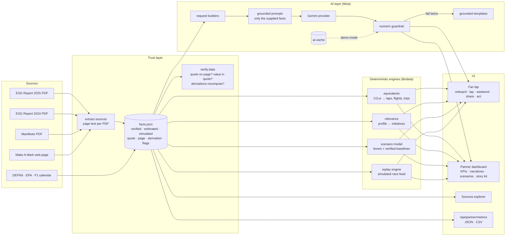
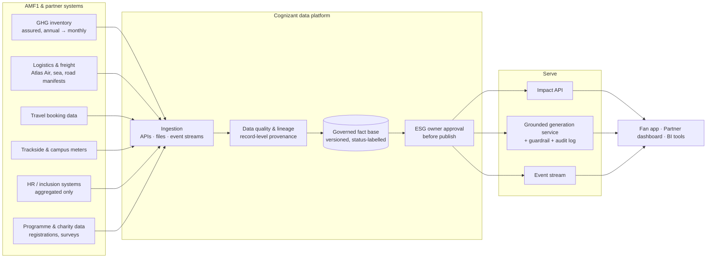

# Architecture

Impact Lap has one idea at its core: **a fact base with provenance, and nothing on screen that isn't in it**. The fan experience, the partner dashboard and the AI all sit on top of that fact base and a set of deterministic engines. The prototype runs entirely from files in the repo; production swaps those files for governed feeds without changing the layers above.

## System diagram (prototype)

## Layers

**Sources → fact base.** `scripts/extract-sources.ts` stores the text of every PDF page. Facts in `data/facts.json` each carry a source, page and verbatim quote, or a derivation over other facts, or a "simulated" note. Nothing is rendered that isn't a fact, a documented calculation over facts, or labelled demo data.

**Verification.** `npm run verify:data` runs in CI and in the unit tests. It normalises typography, finds each quote on its page, checks the value is inside the quote, and recomputes every estimate. When the reports disagree with themselves, the fact carries a quality flag (source conflict, restatement, not comparable, inconsistent equivalence) that the UI shows rather than hides.

**Engines.** Pure TypeScript functions over the fact base: equivalents (conversion factors are themselves facts or cited rows), relevance scoring, the what-if scenario model (lever × verified per-unit baseline, no invented elasticities or costs), and the race-weekend replay. Deterministic, so the same input always gives the same number, and unit-tested.

**AI.** The model never sees the whole dataset. Each request names the facts it may use; the prompt contains only those, formatted; the model must cite `[F:id]` after each claim. The guardrail extracts every number from the output and rejects it unless the number matches a fact or derived value the text actually cites. A rejected draft is retried once with the reasons, then replaced by a grounded template. In demo mode, responses come from a pre-warmed cache, so the live pitch never depends on Wi-Fi.

**Real time.** `/api/events/stream` streams the simulated race-weekend feed over server-sent events; the client falls back to a local replay using the same engine if the stream drops. Milestones fire when a counter crosses a threshold and trigger a drafted campaign post.

## Production: how real feeds plug in

The prototype's JSON files map one-to-one onto governed data products that Cognizant would run on its data platform. The UI and AI layers stay the same; only the loaders change.

| Prototype file | Production source | Owner |
|---|---|---|
| `facts.json` (emissions) | GHG inventory and assurance workpapers (THG Eco / MyCarbon) | AMF1 ESG team |
| `est-freight-per-round` | Per-shipment logistics data with mode and distance | AMF1 logistics + Atlas Air |
| `est-travel-per-round` | Travel booking feed | AMF1 travel |
| Trackside energy facts | F1 trackside metering (already published for European rounds) | F1 / AMF1 |
| Belong facts | Aggregated HR and survey data, minimum group sizes enforced | AMF1 People |
| Community facts, counters | Programme registration and attendance systems, partner reports | AMF1 + partners |
| `events.json` | Operational event stream (freight milestones, sessions, activations) | AMF1 ops |
| `ai-cache` | Generation audit log (prompt, facts, output, guardrail result) | Cognizant |

Principles that carry over unchanged: every datum has a source record; estimates show their formula; nothing is published without the owner's approval; personal data never leaves the source system (only aggregates reach the fact base); AI output is always guard-railed and logged.

## Production rollout

**Phase 0: Prototype (now).** Public reports only, offline demo, one hero race.

**Phase 1: Pilot, one fly-away race (about 8–10 weeks).** Connect logistics and travel feeds for a single race weekend so the Singapore view shows measured rather than allocated emissions. Partner dashboard live for Cognizant's comms team with ESG-owner approval before publish. Success measures: time to produce a partner impact post (target: minutes, not days), share-card rate, quiz completion.

**Phase 2: Season rollout (about one season).** All races, monthly GHG estimates, programme data from Make A Mark partners, Story Kit opened to charity partners, fan experience inside the team app. Add translations for race markets.

**Phase 3: Platform.** Offer the Impact API and Story Kit to other sponsors (Aramco, Arm, Maaden, Xerox...) so each can report its joint impact with the team from the same governed fact base.

### What Cognizant would own

Data platform and ingestion, the governed fact base and lineage, the grounded-generation service with guardrail and audit log, the Impact API, and the partner dashboard. AMF1 owns the data, the approvals and the fan-facing brand experience.

### Cost drivers

Data engineering for the first feeds (logistics, travel, energy) is the main cost; after that, marginal cost per race is low. Model usage is small because generation is short, grounded and heavily cached (most fan copy is shared across personas). Hosting is a standard web app plus a streaming endpoint. No new hardware; meters and logistics systems already exist.

### Risks and mitigations

- **Data availability and quality**: the 2025 report already contains internal inconsistencies (see `docs/data-sources.md`). Mitigation: quality flags and owner approval are part of the pipeline, not an afterthought.
- **AI accuracy**: guardrail, citations, templates as fallback, audit log.
- **Privacy**: inclusion data only as published aggregates; no individual-level data in the fact base.
- **Greenwashing perception**: estimates and simulations are always labelled; gaps are shown as gaps.
