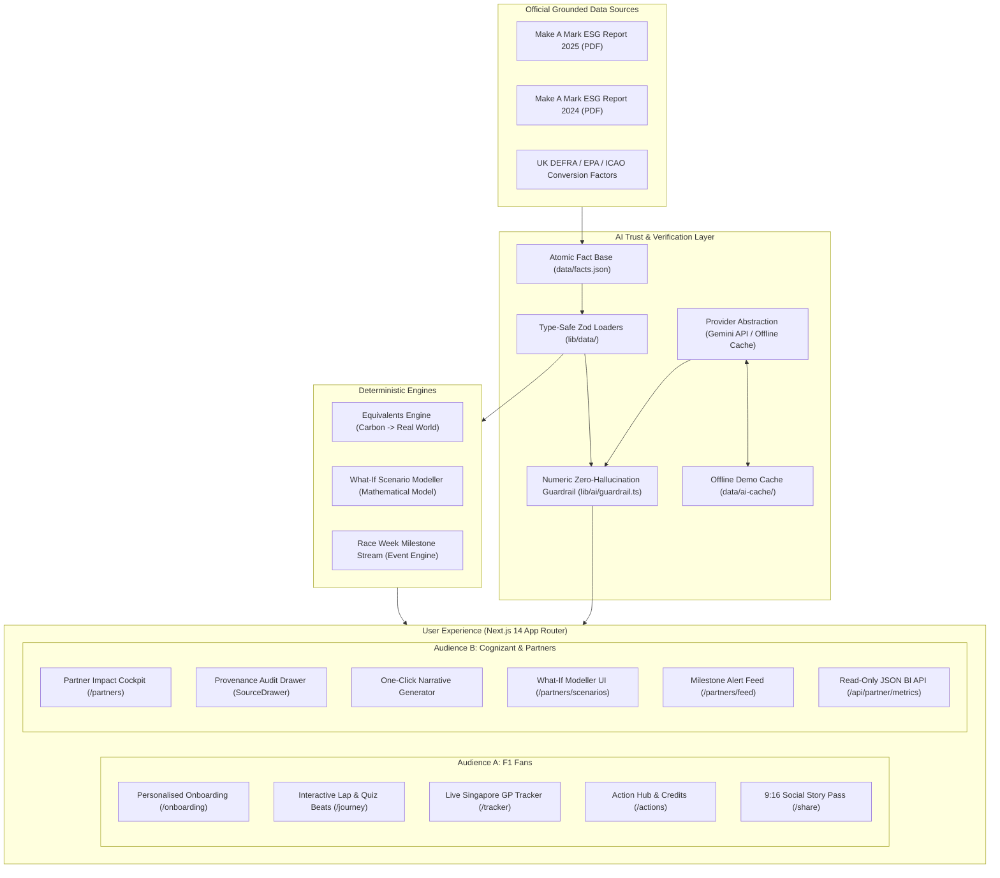
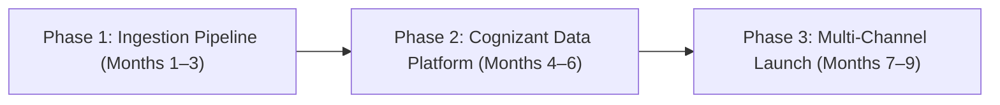

# Technical Architecture & Production Rollout: Impact Lap

**Platform:** Impact Lap (AMF1 × Cognizant Sustainability Impact Platform)  
**Pitch & Demo Version:** 1.0.0 (Pre-Singapore GP 2026)  

---

## 1. System Architecture Diagram

---

## 2. Core Architectural Components

### A. The Atomic Fact Base & Schema Enforcement
- All quantitative claims reside in `data/facts.json`, typed strictly with `FactSchema` (`lib/data/schemas.ts`).
- Every fact includes:
  - `id`: Unique identifier (e.g. `FACT-E-04`)
  - `pillar`: Environment, Belong, Community, or Governance
  - `metric`, `value`, `unit`, `period`
  - `source_doc` & `page`: Verifiable official citation
  - `status`: `verified`, `estimated`, or `simulated`
  - `partner_relevant`: Boolean flag for corporate filtering

### B. The AI Trust Layer & Post-Generation Numeric Guardrail
In enterprise ESG communication, hallucinated metrics pose severe legal, regulatory, and reputational hazards. To eliminate hallucination:
1. **Fact-Restricted Prompts**: Every task receives strictly the filtered set of relevant facts and is instructed to cite fact IDs.
2. **Deterministic Post-Generation Validator**:
   - Uses regex tokenization to extract every numeric value, floating-point decimal, and percentage in the LLM output.
   - Compares the extracted numbers against the set of approved fact values, documented calculation outputs, and standard timeline years.
   - Any text containing an unapproved number is automatically rejected before presentation to the user.
3. **Dual-Mode Provider (`lib/ai/provider.ts`)**:
   - **Live Mode**: Calls Google Gemini 1.5 Flash via `@google/generative-ai`.
   - **Demo / Offline Mode (`DEMO_MODE=true`)**: Intercepts requests and serves pre-computed responses from `data/ai-cache/`, guaranteeing zero network dependency and instantaneous response times during high-stakes presentations.

### C. Deterministic Calculation Engines
- **Equivalents Engine (`lib/data/equivalents.ts`)**: Computes relatable comparisons (urban tree years, household electricity days, long-haul return flights) using published factors from UK DESNZ/DEFRA, US EPA, and ICAO.
- **Scenario Modeller (`lib/data/scenario-model.ts`)**: Applies mathematical formulas to project Scope 3 emissions abatement and STEM expansion based on slider inputs, leaving the LLM responsible only for explaining the verified outputs in plain English.

---

## 3. Production Rollout Plan (Cognizant Enterprise Integration)

### Phase 1 (Months 1–3): Real-Time Telemetry Ingestion
- **Logistics EDI Integration**: Direct automated connectors to DHL Global Forwarding systems for air charter fuel manifests, sea-freight routing, and SAFc certificate batch validations.
- **Campus IoT & Smart Metering**: Live data streams from AMR Technology Campus solar arrays, battery storage banks, and renewable grid supply.
- **HR & Education Tracking**: Real-time integration with Make A Mark event registration portals and partner STEM workshop attendance tracking.

### Phase 2 (Months 4–6): Cognizant Enterprise Data & AI Platform
- **Data Lakehouse Integration**: Cognizant builds and hosts a high-throughput ESG telemetry ingestion lakehouse on Microsoft Azure / AWS, applying automated data cleansing and schema validation.
- **Automated Provenance Blockchain / Hash Ledger**: Generating immutable SHA-256 verification hashes for every ESG milestone to satisfy CSRD (Corporate Sustainability Due Diligence Directive) and GRI audit requirements.
- **Model Orchestration & Guardrail Ops**: Enterprise deployment of grounded LLM agents using Cognizant's proprietary responsible AI governance frameworks.

### Phase 3 (Months 7–9): Multi-Channel Fan & Partner Distribution
- **Official F1 App Widget**: Embedding the "Impact Lap" interactive story and carbon tracker directly inside the official Aston Martin Aramco F1 Team mobile app.
- **Partner Portal & BI Connectors**: Deploying custom PowerBI / Tableau data connectors via `/api/partner/metrics` for Cognizant, Aramco, and partner sustainability teams.
- **Trackside Paddock Kiosks**: Interactive touchscreens installed in AMF1 hospitality suites and Fan Villages at the British and Singapore Grands Prix.

---

## 4. Cognizant Ownership & Value Creation

| Dimension | Cognizant Role & Ownership | Business Impact |
|---|---|---|
| **Data Platform & Ingestion** | Designs, deploys, and manages the real-time ESG lakehouse and API gateway. | Showcases Cognizant's data engineering and IoT integration capabilities to global enterprise clients. |
| **Generative AI Trust Layer** | Owns the prompt orchestration, provenance verification engine, and numeric guardrail. | Positions Cognizant as a global leader in audited, hallucination-free generative AI for regulated sectors. |
| **Sponsor Intelligence Cockpit** | Uses the co-branded dashboard internally for ESG reporting, investor relations, and marketing. | Dramatically reduces manual ESG reporting labor and provides verifiable ROI on sports sponsorship spend. |

---

## 5. Cost Drivers & Operational Feasibility

- **Compute & Hosting**: Extremely low. Next.js serverless execution on Vercel or cloud containers with static page generation keeps infrastructure costs under \$100/month at scale.
- **AI Inference**: The architecture leverages lightweight, highly efficient models (Gemini 1.5 Flash) with caching for common fan personas, keeping monthly LLM inference costs negligible.
- **Maintenance**: Deterministic JSON fact base and Zod schema validation prevent schema drift and eliminate ongoing database administrative overhead.
