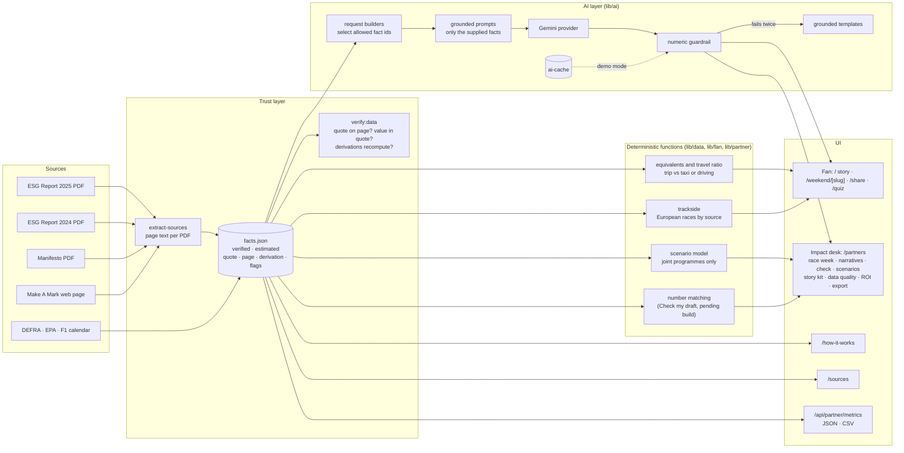
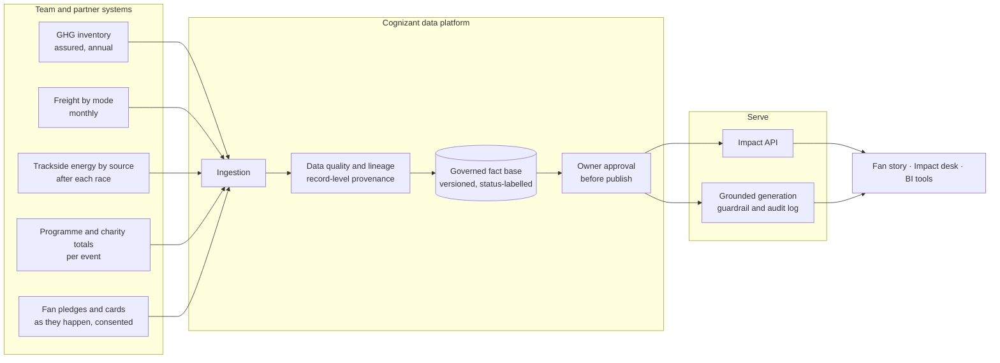

# Architecture

Off Camera has one idea at its core: **a fact base with provenance, and nothing on screen that isn't in it**. The fan story, the partner desk and the AI all sit on top of that fact base and a small set of deterministic functions. The prototype runs entirely from files in the repo; production would replace those files with governed feeds without changing the layers above.

Parts marked **(pending build)** are specified in `docs/overhaul/overhaul-brief.md` but not yet in the code on this branch.

## What changed in the September 2026 overhaul

| Removed                                                                                                                       | Added                                                                                                 |
| ----------------------------------------------------------------------------------------------------------------------------- | ----------------------------------------------------------------------------------------------------- |
| `/start` (questionnaire), `/lap` and `/act`, now permanent redirects to `/` in `next.config.ts`                               | `/` as the single scroll-led story, following the report's footprint map                              |
| The simulated race-weekend feed: `lib/live`, `/api/events/stream`, `data/events.json`, `data/counters.json` and their schemas | `/how-it-works` for judges and partners (pending build; copy in `docs/overhaul/how-it-works-copy.md`) |
| Impact credits and the milestone post request                                                                                 | Check my draft on the partner desk (pending build)                                                    |
| The three illustrative `sg-*` initiatives                                                                                     | Draft to approved state with reviewer and timestamp on narratives (pending build)                     |
| Anything with `status: "simulated"` in the product; a unit test now enforces this                                             | "This race week", Data quality, ROI and Export tabs on the desk (pending build)                       |

## System diagram (prototype)

```mermaid
flowchart LR
  subgraph Sources
    R25[ESG Report 2025 PDF]
    R24[ESG Report 2024 PDF]
    MAN[Manifesto PDF]
    WEB[Make A Mark web page]
    EXT[DEFRA · EPA · F1 calendar]
  end

  subgraph Trust["Trust layer"]
    EXTRACT[extract-sources<br/>page text per PDF]
    FACTS[("facts.json<br/>verified · estimated<br/>quote · page · derivation · flags")]
    VERIFY["verify:data<br/>quote on page? value in quote?<br/>derivations recompute?"]
  end

  subgraph Engines["Deterministic functions (lib/data, lib/fan, lib/partner)"]
    EQ[equivalents and travel ratio<br/>trip vs taxi or driving]
    TRK[trackside<br/>European races by source]
    SCN[scenario model<br/>joint programmes only]
    MATCH["number matching<br/>(Check my draft, pending build)"]
  end

  subgraph AI["AI layer (lib/ai)"]
    SEL[request builders<br/>select allowed fact ids]
    PROMPT[grounded prompts<br/>only the supplied facts]
    MODEL[Gemini provider]
    GUARD[numeric guardrail]
    TPL[grounded templates]
    CACHE[(ai-cache)]
  end

  subgraph UI
    FAN["Fan: / story · /weekend/[slug] · /share · /quiz"]
    DESK["Impact desk: /partners<br/>race week · narratives · check · scenarios<br/>story kit · data quality · ROI · export"]
    HOW["/how-it-works"]
    SRC["/sources"]
    API["/api/partner/metrics<br/>JSON · CSV"]
  end

  R25 & R24 & MAN & WEB --> EXTRACT --> FACTS
  EXT --> FACTS
  FACTS --> VERIFY
  FACTS --> EQ & TRK & SCN & MATCH
  FACTS --> SEL --> PROMPT --> MODEL --> GUARD
  GUARD -- fails twice --> TPL
  CACHE -. demo mode .-> GUARD
  EQ & TRK & GUARD --> FAN
  SCN & MATCH & GUARD --> DESK
  FACTS --> SRC & API & HOW
```

## Routes

| Route                  | Audience                    | What it does                                                                                                                                                                                                                                                                               |
| ---------------------- | --------------------------- | ------------------------------------------------------------------------------------------------------------------------------------------------------------------------------------------------------------------------------------------------------------------------------------------ |
| `/`                    | Fans                        | The story: title page, "What you'll get", six chapters (campus, supply chain, moving the team, at the circuit, beyond the track, the finish line), then "Your race weekend" for Singapore. Depth toggle "New to F1" / "Watched for years". Chapter tracker. (Story rebuild pending build.) |
| `/weekend/[slug]`      | Fans                        | One race: what the team published for it (trackside energy by source where it exists, otherwise a data gap), linked programmes, getting there, season context in the detail layer. `singapore-2026` is the hero race.                                                                      |
| `/share`               | Fans                        | 9:16 card: travel plan line, one team fact from a curated safe list, quiz badge if earned. PNG export in the browser (`html-to-image`). No name by default.                                                                                                                                |
| `/quiz`                | Fans                        | The three-question knowledge check on its own.                                                                                                                                                                                                                                             |
| `/partners`            | Cognizant, charity partners | The Impact desk. Tabs: This race week, Narratives, Check my draft, Scenarios, Story kit, Data quality, ROI, Export. Today the code has Overview, Narratives, Scenarios and Story kit as sub-routes; the tab set is pending build.                                                          |
| `/how-it-works`        | Judges, partners            | The problem, the audiences, the four AI steps, the guardrail, what is real now versus the pilot, ROI measures, pilot and business model. Placeholder in code; full page pending build.                                                                                                     |
| `/sources`             | Everyone                    | Fact explorer, quality flags and method.                                                                                                                                                                                                                                                   |
| `/api/ai/generate`     | App                         | `POST AiRequest` returns a guarded `AiResponse`.                                                                                                                                                                                                                                           |
| `/api/partner/metrics` | Partner BI tools            | Read-only JSON, or CSV with `?format=csv`. See `docs/partner-api.md`.                                                                                                                                                                                                                      |

## Layers

**Sources to fact base.** `scripts/extract-sources.ts` stores the text of every PDF page in `sources/text/<id>.json`. Each fact in `data/facts.json` carries a source, page and verbatim quote, or a derivation over other facts. Nothing is rendered that isn't a fact or a documented calculation over facts. The schema still allows `simulated`, but no shipped fact or initiative uses it and a unit test fails the build if one does.

**Verification.** `npm run verify:data` runs in `npm run check` and in the unit tests. It normalises typography, finds each quote on its page, checks the value is inside the quote, and recomputes every estimate. Where the reports disagree with themselves, the fact carries a quality flag (`source-conflict`, `restated`, `not-comparable`, `inconsistent-equivalence`). Flags are shown on `/sources` and the partner desk; fan pages never show flagged or disputed figures (`FactValue` hides flags unless `showFlags` is set).

**Deterministic functions.** Pure TypeScript over the fact base, unit-tested:

- `lib/data/equivalents.ts`: the fan's trip compared with a taxi or driving, using DEFRA proxy factors from `data/travel-modes.json` (Estimated). Laps of Silverstone appear only where the report prints them (`e25-saf-laps`, `e25-cups-laps`).
- `lib/fan/trackside.ts`: trackside energy by source for the European races in the 2025 report.
- `lib/data/scenario.ts`: what-ifs for joint programmes, multiplying verified baselines; no invented costs or elasticities.
- `lib/data/numbers.ts`: number extraction and matching, shared by the verifier and the guardrail.
- Check my draft (pending build): runs pasted copy through the same number matching against the whole fact base, suggests a citation for each matched number and holds back any number that matches nothing.

**AI.** The model never sees the whole dataset.

1. **Select.** Request builders (`lib/ai/requests.ts`) name the fact ids a request may use, and exclude what is not allowed (flagged figures on fan pages, pay-gap figures in personalisation).
2. **Explain and draft.** The prompt (`lib/ai/prompts.ts`) contains only those facts; the model must cite `[F:id]` after each claim.
3. **Check.** `lib/ai/guardrail.ts` extracts every number and rejects the text unless each matches a fact or derived value the text actually cites, and every cited id was supplied.
4. **Fall back.** A rejected draft is retried once with the reasons, then replaced by a grounded template (`lib/ai/templates.ts`). `lib/ai/engine.ts` never throws to the route.

In demo mode (the default, see `isDemoMode()` in `lib/config.ts`) responses come from `data/ai-cache/<task>.json`, falling back to templates, so the pitch never depends on a network. With `GEMINI_API_KEY` set and `DEMO_MODE=false`, the model drafts and the same check applies. Every response records `generator.kind` (`model` or `template`); the UI shows it beside the "Figures checked" label.

**Approvals (pending build).** Narratives move from draft to approved with a reviewer name and timestamp. In the prototype this state is stored in the browser's local storage; in the pilot it moves to a shared store with an audit log.

**No simulated feed.** The earlier simulated race-weekend replay, its counters and milestone posts were removed. A trackside or programme feed is part of the pilot plan, described in words (`docs/ROI.md`), not shown as working UI. Every figure is labelled "Updated when the team publishes".

## Production: how real feeds would plug in

The JSON schemas in `lib/data/schemas.ts` are a proposed contract for governed data products that Cognizant could run on its data platform. The pilot's data-sharing agreement must confirm source-system access, field mapping, update cadence, assurance and publishing ownership before anything is connected. Connecting real systems is ingestion and approval work, not a loader swap.

```mermaid
flowchart LR
  subgraph Team["Team and partner systems"]
    GHG["GHG inventory<br/>assured, annual"]
    LOG[Freight by mode<br/>monthly]
    ENERGY[Trackside energy by source<br/>after each race]
    PROG[Programme and charity totals<br/>per event]
    FANS[Fan pledges and cards<br/>as they happen, consented]
  end

  subgraph Platform["Cognizant data platform"]
    ING[Ingestion]
    DQ["Data quality and lineage<br/>record-level provenance"]
    FB[("Governed fact base<br/>versioned, status-labelled")]
    APPROVE[Owner approval<br/>before publish]
  end

  subgraph Serve
    APIGW[Impact API]
    AIS[Grounded generation<br/>guardrail and audit log]
  end

  GHG & LOG & ENERGY & PROG --> ING --> DQ --> FB --> APPROVE --> APIGW & AIS
  FANS --> ING
  APIGW --> Apps[Fan story · Impact desk · BI tools]
  AIS --> Apps
```

| Prototype file or fact                           | Production source (candidate)                                 | Cadence (assumption)             | Owner                                       |
| ------------------------------------------------ | ------------------------------------------------------------- | -------------------------------- | ------------------------------------------- |
| Emissions facts in `facts.json`                  | Approved GHG inventory and assurance workpapers               | Annual, with the report          | Team ESG owner                              |
| `e25-freight-logistics`, `est-freight-per-round` | Shipment records with mode and distance                       | Monthly                          | Team logistics owner and logistics partners |
| `e25-trackside-*` and the Singapore data gap     | Approved trackside metering by source                         | One to two weeks after each race | Data owner to confirm                       |
| Belong facts                                     | Published or approved aggregates, with minimum group sizes    | Annual                           | Team People owner                           |
| Community and charity facts                      | Programme registrations and charity confirmations             | Per event                        | Team and programme partners                 |
| Share and quiz events                            | Consented, aggregate fan events                               | As they happen                   | Team digital owner                          |
| Approvals in local storage                       | Shared approval store with audit log                          | Per draft                        | Named approvers at the team and Cognizant   |
| `data/ai-cache`                                  | Generation audit log: prompt, facts, output, guardrail result | Per draft                        | Cognizant                                   |

Principles that carry over unchanged: every datum has a source record; estimates show their formula; nothing is published without the owner's approval; personal data never leaves the source system; AI output is always checked, labelled and logged.

## Rollout

The pilot plan, team, phases and risks are in `docs/ROI.md`. In short: a data-sharing agreement and approval workflow in Q4 2026; live with published facts from pre-season to race 6; one approved per-race feed added mid-season; evaluation at season end.

### What Cognizant would own

Proposed Cognizant scope: data platform and ingestion, the governed fact base and lineage, the grounded-generation service with guardrail and audit log, the Impact API and the partner desk. Proposed team scope: data ownership, publishing approvals and the fan brand. Final responsibilities need agreement with the team and each source-system owner.

### Cost drivers

Data discovery and the first approved feed are likely to be the main cost. Ongoing cost depends on source quality, assurance, approval cadence and traffic. Generation is kept small by short grounded outputs and caching, and the product still works on templates if the model is unavailable. The prototype does not establish integration licence or support costs; the pilot measures them.
