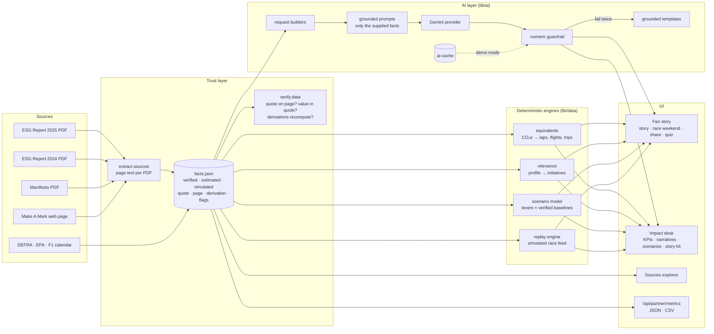
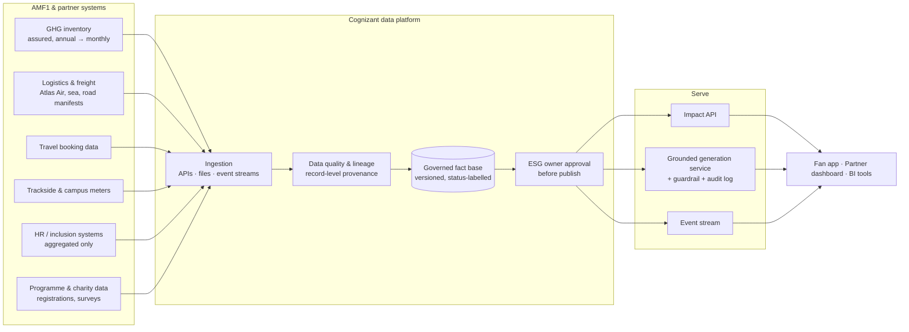

# Architecture

Impact Lap has one idea at its core: **a fact base with provenance, and nothing on screen that isn't in it**. The fan experience, the partner dashboard and the AI all sit on top of that fact base and a set of deterministic engines. The prototype runs entirely from files in the repo; production swaps those files for governed feeds without changing the layers above.

## System diagram (prototype)

```mermaid
flowchart LR
  subgraph Sources
    R25[ESG Report 2025 PDF]
    R24[ESG Report 2024 PDF]
    MAN[Manifesto PDF]
    WEB[Make A Mark web page]
    EXT[DEFRA · EPA · F1 calendar]
  end

  subgraph Trust["Trust layer"]
    EXTRACT[extract-sources<br/>page text per PDF]
    FACTS[("facts.json<br/>verified · estimated · simulated<br/>quote · page · derivation · flags")]
    VERIFY["verify:data<br/>quote on page? value in quote?<br/>derivations recompute?"]
  end

  subgraph Engines["Deterministic engines (lib/data)"]
    EQ[equivalents<br/>CO₂e → laps, flights, trips]
    REL[relevance<br/>profile → initiatives]
    SCN[scenario model<br/>levers × verified baselines]
    LIVE[replay engine<br/>simulated race feed]
  end

  subgraph AI["AI layer (lib/ai)"]
    REQ[request builders]
    PROMPT[grounded prompts<br/>only the supplied facts]
    MODEL[Gemini provider]
    GUARD[numeric guardrail]
    TPL[grounded templates]
    CACHE[(ai-cache)]
  end

  subgraph UI
    FAN[Fan story<br/>story · race weekend · share · quiz]
    PARTNER[Impact desk<br/>KPIs · narratives · scenarios · story kit]
    SRC[Sources explorer]
    API["/api/partner/metrics<br/>JSON · CSV"]
  end

  R25 & R24 & MAN & WEB --> EXTRACT --> FACTS
  EXT --> FACTS
  FACTS --> VERIFY
  FACTS --> EQ & REL & SCN & LIVE
  FACTS --> REQ --> PROMPT --> MODEL --> GUARD
  GUARD -- fail twice --> TPL
  CACHE -. demo mode .-> GUARD
  EQ & REL & SCN & LIVE & GUARD --> FAN & PARTNER
  FACTS --> SRC & API
```

## Layers

**Sources → fact base.** `scripts/extract-sources.ts` stores the text of every PDF page. Facts in `data/facts.json` each carry a source, page and verbatim quote, or a derivation over other facts, or a "simulated" note. Nothing is rendered that isn't a fact, a documented calculation over facts, or labelled demo data.

**Verification.** `npm run verify:data` runs in CI and in the unit tests. It normalises typography, finds each quote on its page, checks the value is inside the quote, and recomputes every estimate. When the reports disagree with themselves, the fact carries a quality flag (source conflict, restatement, not comparable, inconsistent equivalence) that the UI shows rather than hides.

**Engines.** Pure TypeScript functions over the fact base: equivalents (conversion factors are themselves facts or cited rows), relevance scoring, the what-if scenario model (lever × verified per-unit baseline, no invented elasticities or costs), and the race-weekend replay. Deterministic, so the same input always gives the same number, and unit-tested.

**AI.** The model never sees the whole dataset. Each request names the facts it may use; the prompt contains only those, formatted; the model must cite `[F:id]` after each claim. The guardrail extracts every number from the output and rejects it unless the number matches a fact or derived value the text actually cites. A rejected draft is retried once with the reasons, then replaced by a grounded template. In demo mode, responses come from a pre-warmed cache, so the live pitch never depends on Wi-Fi.

**No simulated feed.** The earlier simulated race-weekend replay, its counters and milestone posts were removed in the September 2026 overhaul. A trackside or programme feed is part of the pilot plan: it would refresh after each race weekend once an approved source and data owner exist, and is described in words rather than shown as working UI.

## Production: how real feeds plug in

The prototype's JSON schemas are a proposed contract for governed data products that Cognizant could run on its data platform. A production discovery must confirm source-system access, field mapping, update frequency, assurance and publishing ownership. The UI and AI layers are designed to consume that contract; connecting real systems will require ingestion and approval work rather than a loader swap alone.

```mermaid
flowchart LR
  subgraph AMF1["AMF1 & partner systems"]
    GHG["GHG inventory<br/>assured, annual → monthly"]
    LOG[Logistics & freight<br/>Atlas Air, sea, road manifests]
    TRAVEL[Travel booking data]
    ENERGY[Trackside & campus meters]
    HR["HR / inclusion systems<br/>aggregated only"]
    PROG[Programme & charity data<br/>registrations, surveys]
  end

  subgraph Platform["Cognizant data platform"]
    ING[Ingestion<br/>APIs · files · event streams]
    DQ["Data quality & lineage<br/>record-level provenance"]
    FB[("Governed fact base<br/>versioned, status-labelled")]
    APPROVE[ESG owner approval<br/>before publish]
  end

  subgraph Serve
    APIGW[Impact API]
    AIS[Grounded generation service<br/>+ guardrail + audit log]
    STREAM[Event stream]
  end

  GHG & LOG & TRAVEL & ENERGY & HR & PROG --> ING --> DQ --> FB --> APPROVE --> APIGW & AIS & STREAM
  APIGW --> Apps[Fan app · Partner dashboard · BI tools]
  AIS --> Apps
  STREAM --> Apps
```

| Prototype file | Production source | Owner |
|---|---|---|
| `facts.json` (emissions) | Candidate: approved GHG inventory and assurance workpapers | Team ESG owner |
| `est-freight-per-round` | Candidate: shipment records with mode and distance | Team logistics owner and logistics partners |
| `est-travel-per-round` | Candidate: aggregated travel-booking data | Team travel owner |
| Trackside energy facts | Candidate: approved circuit or team trackside metering | Relevant data owner to confirm |
| Belong facts | Candidate: published or approved aggregate people and survey data, with minimum group sizes | Team People owner |
| Community facts | Candidate: programme registration, attendance and partner reports | Team and programme partners |
| Race-weekend activity (future) | Candidate: approved operational milestones and activation events | Team operations and communications owners |
| `ai-cache` | Generation audit log (prompt, facts, output, guardrail result) | Cognizant |

Principles that carry over unchanged: every datum has a source record; estimates show their formula; nothing is published without the owner's approval; personal data never leaves the source system (only aggregates reach the fact base); AI output is always guard-railed and logged.

## Production rollout

**Phase 0: Prototype (now).** Public reports only, offline demo, one hero race.

**Phase 1: Discovery and one-race pilot.** Confirm data owners, permissions, field mappings and update frequencies for logistics and travel. Connect the sources that pass that assessment for one race weekend, while keeping estimates and gaps visible for the rest. Trial the partner dashboard with the Cognizant communications team and an ESG-owner approval step. Set a delivery estimate only after access and data quality are understood. Success measures: story completion, share-card rate, optional challenge participation, content reuse and measured review time.

**Phase 2: Broader rollout, subject to pilot results.** Add races and approved programme datasets in stages, open the Story Kit to selected charity partners, and assess integration with team-owned channels. Add translations for prioritised race markets after content owners and review workflows are in place.

**Phase 3: Platform option.** If the pilot demonstrates demand and the team approves the commercial model, extend the Impact API and Story Kit to selected partners so each can communicate approved joint impact from the same governed fact base.

### What Cognizant would own

Proposed Cognizant scope: data platform and ingestion, the governed fact base and lineage, the grounded-generation service with guardrail and audit log, the Impact API, and the partner dashboard. Proposed team scope: data ownership, publishing approvals and the fan-facing brand experience. Final responsibilities require agreement with the team and each source-system owner.

### Cost drivers

Data discovery and engineering for the first approved feeds are likely to be the main cost. Ongoing cost depends on source-system quality, assurance, approval cadence, localisation and traffic. Generation can be constrained through short grounded outputs and caching. The web app and event endpoint use standard hosting, but the prototype does not establish whether additional metering, integration licences or operational support will be needed.

### Risks and mitigations

- **Data availability and quality**: the 2025 report already contains internal inconsistencies (see `docs/data-sources.md`). Mitigation: quality flags and owner approval are part of the pipeline, not an afterthought.
- **AI accuracy**: guardrail, citations, templates as fallback, audit log.
- **Privacy**: inclusion data only as published aggregates; no individual-level data in the fact base.
- **Greenwashing perception**: estimates and simulations are always labelled; gaps are shown as gaps.
